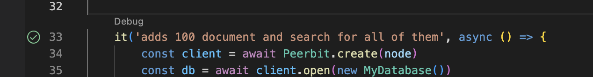

# Peerbit boilerplate project
This project contains a minimal configuration on how to use Peerbit and do testing with Jest

In [index.ts](./src/index.ts) we are creatinga  Database for text documents, which we try out in the [tests](./src/index.test.ts)

## [Getting started guide about this project](./getting-started.md)

## Install
```sh
yarn install
```
(or use npm if you like)

## Test 
```sh
yarn test
```

## Build
```sh 
yarn build
```

## VS Code users
.vscode folder is included in this project

If you install the [Jest extension](https://marketplace.visualstudio.com/items?itemName=Orta.vscode-jest) (tested with v5.0.2 version of the extension) in VS Code, you can easily debug your tests, like this:

<p align="center">
    
</p>

You can right click the green checkmark to get more debug options.


